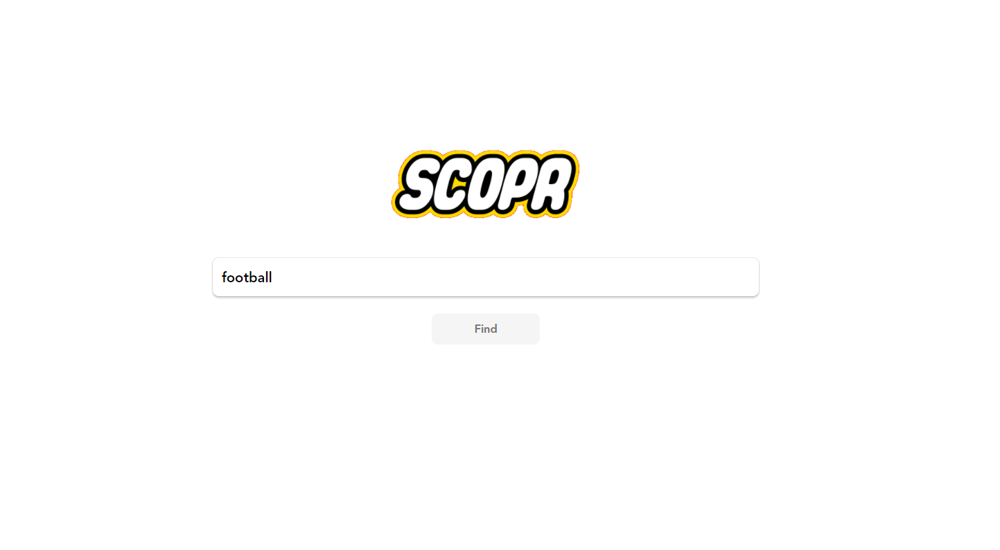
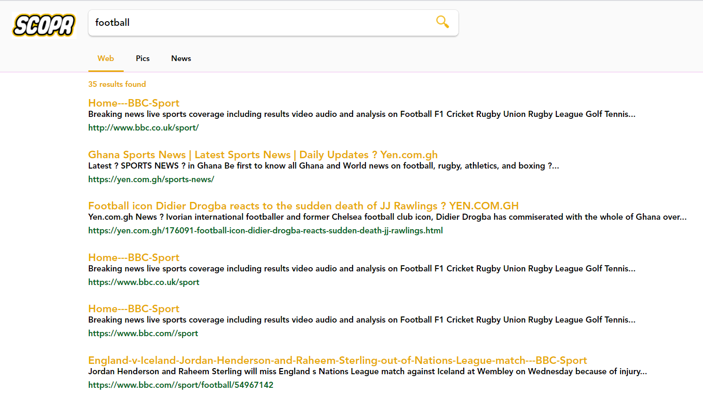
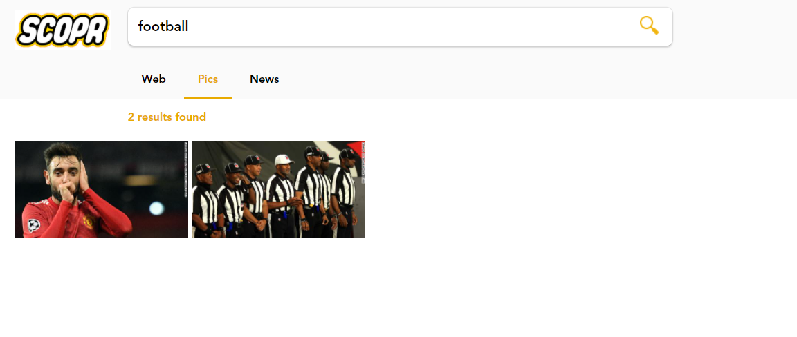

# Flex Box and PHP based Google Clone

Description
```
$ UI/UX built with flex box
$ Custom crawler using file_get_contents for links(href), titles, images(img elements and src attribute)

```
<h2 id="screenshots">Screenshots</h2>

<!-- 

 -->


